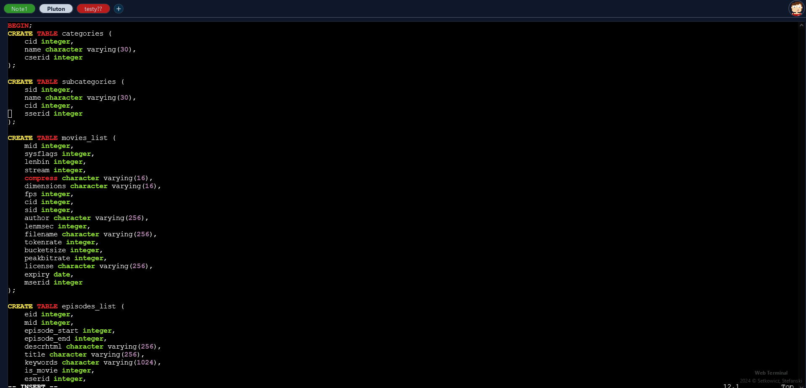
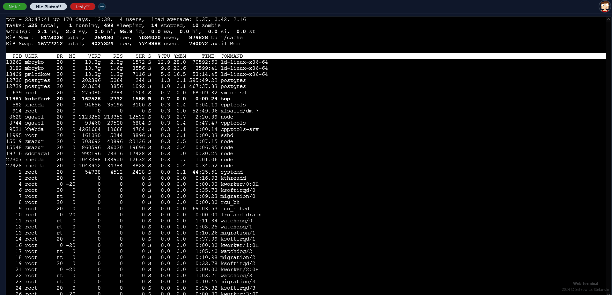
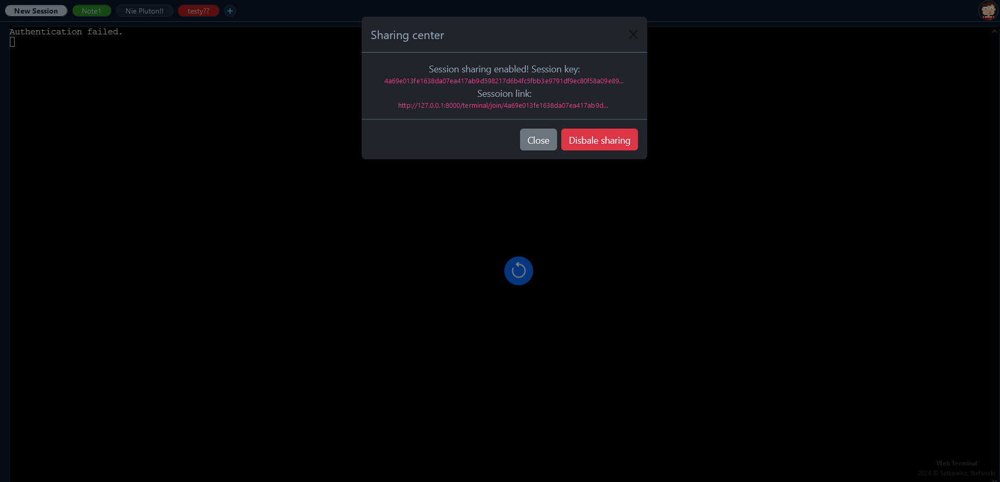
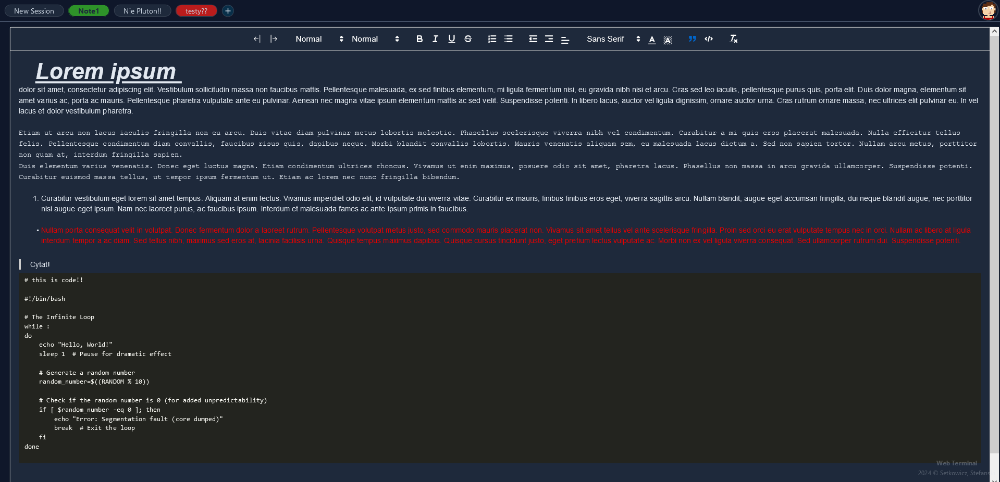
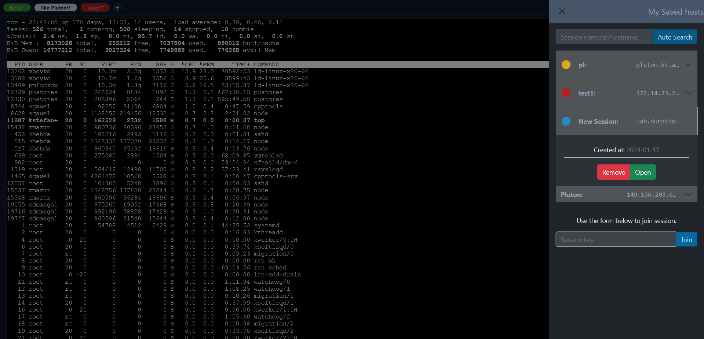
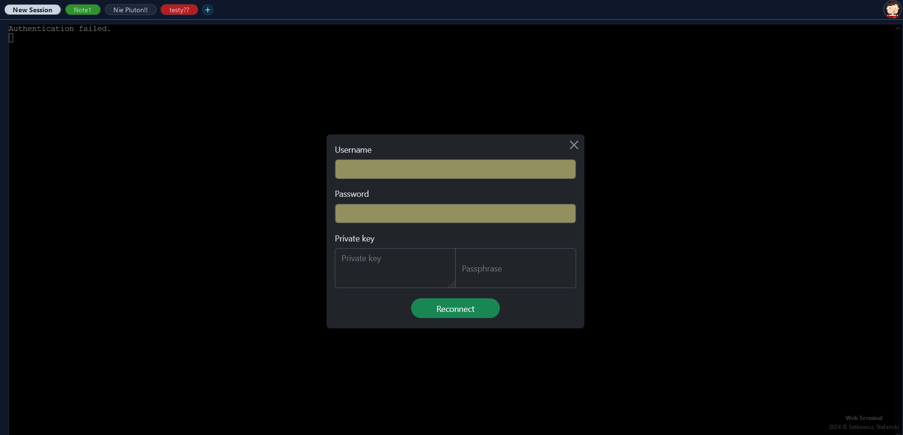

# Project README

## Getting Started

### Prerequisites

- Python >3.11
- Redis >7.2 (Memurial – Redis DB for Windows - Version. 4.1.0. 4.1.0)

## Installation

Clone the repository: 
```bash
git clone https://github.com/Cristi-la/webterminal
cd webterminal/web
```

Install dependencies using pip and the provided requirements.txt file:
```bash
pip install -r requirements.txt 
```

## Running the Project

### Django Setup

1. Apply database migrations:

```bash
python manage.py makemigrations
python manage.py migrate
```

2. Create a superuser:

```bash
python manage.py createsuperuser
```

3. Run the development server:

```bash
python manage.py runserver
```

> The project should now be accessible at http://localhost:8000/.

### Python and Redis Version

Make sure you have Redis installed, as the project relies on it. You can download it from https://redis.io/. If you are using windows machine you can install Redis for Windows alternative, In-Memory Datastore - Memurial: https://www.memurai.com/


## Screenshots:

###  Use of ssh terminal - ssh functionality


###  Server side session sharing - like in tmux!!!

> Both notes and ssh is shareable!

###  Notes functionality

###  Saved session list

###  Reconnect button



### License
All rights reserved. Use without permission strictly prohibited.


